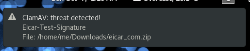

# downloaded-files-virus-scan

Script to monitor the `~/Downloads` folder and scan new files for viruses using [ClamAV](https://www.clamav.net/) anti-virus.

## Prerequisites

This script was written in [BASH](https://www.gnu.org/software/bash/) which should come pre-installed on almost all Linux distributions. It depends on ClamAV (`clamscan`), [inotify-tools](https://github.com/rvoicilas/inotify-tools/wiki) (`inotifywait`) and [Gnome's libnotify](https://developer.gnome.org/libnotify/) (`notify-send`).

It was successfully tested on a [Fedora](https://getfedora.org/) 28 Workstation running GNU BASH 4.4.23, inotify-tools 3.14, ClamAV 0.100.1 and libnotify 0.7.7.

* For other Linux distributions you might want to adjust the the path to the `dialog-warning-symbolic.svg` file inside the shell script, because it will likely be different.
* Instructions on how to install ClamAV can be found [here](https://www.clamav.net/documents/installing-clamav).

## Installing

Note: the brief instructions below assume the reader has some basic knowledge of how to use a Linux Desktop system running [Gnome](https://www.gnome.org/).

Simply copy the `io.techwords.scan-download.desktop` file into the `${HOME}/.config/autostart` directory and the `scan-download.sh` script into a directory of your choice (suggestion: `${HOME}/bin`), set the execute permission on the `.sh` script (e.g. `chmod u+x scan-download.sh`), and adjust the `Exec=` line inside the `.desktop` file so it points to where you copied the `.sh` script. Restart Gnome or reboot your computer.

## Testing

After restarting Gnome or your computer, you can download any of the [EICAR's standard anti-virus test files](https://www.eicar.org/anti_virus_test_file.htm) into the `$HOME/Downloads` directory to see if you get a notification. For instance:

```
$ wget -P ~/Downloads https://www.eicar.org/download/eicar_com.zip
```

After a few seconds you should see a desktop notification like the one below:



You can also check if the necessary processes are running by executing the following command:

```
$ pstree -aT $(pgrep -x flock)
```

You should then see something like the following:

```
flock -en /run/user/1000/scan-download.lock ...
  └─scan-download.s /home/me/bin/scan-download.sh
      └─inotifywait -qmr -e close_write -e moved_to /home/me/Downloads
```

Moreover, you can check if the two temporary files were also created by executing the following command:

```
$ ls -F ${XDG_RUNTIME_DIR:-/tmp}/scan-download*
```

Which should produce something like the following output:

```
/run/user/1000/scan-download|  /run/user/1000/scan-download.lock
```

## Usage

If the tests above succeeded there is nothing else to do. Simply make sure that every new download goes into your `Downloads` folder, which is the one being monitored.

Note that the process of scanning a new downloaded file takes a few seconds, so it's recommended to wait a bit (e.g. 30s) before using that file to ensure you won't get a virus notification.

The `.sh` script uses a lock file to prevent multiple instances of itself. It also cleans-up after itself if it's terminated so no files should be left on the system if it's not running. The `inotifywait` command continuously monitors the directory `$HOME/Downloads` for `close_write` and `moved_to` events and sends those into a FIFO file which is continuously polled by the script. The script then scans with `clamscan` the file that triggered the event, and if a virus is found it generates a desktop notification using `notify-send`.

## Tweaks

* You might want to use `clamdscan` instead of `clamscan` if you download lots of files, because it is a lot faster, but it consumes more RAM (~1GB) and requires configuration.
* More visible notifications can be achieved by replacing `notify-send` with [`zenity`](https://wiki.gnome.org/Projects/Zenity) (Gnome) or [`kdialog`](https://userbase.kde.org/Kdialog) (KDE).

## License

This project is licensed under the MIT License - see the [LICENSE](LICENSE) file for details.

