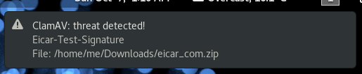

# downloaded-files-virus-scan

Script to monitor the `~/Downloads` folder and scan new files for viruses using [ClamAV](https://www.clamav.net/) anti-virus.

## Prerequisites

This script requires Linux, Bash, ClamAV (`clamscan`), [inotify-tools](https://github.com/inotify-tools/inotify-tools) **3.22.6 or newer** (`inotifywait` with `%0` and `--no-newline`), util-linux (`flock`), GNU coreutils, AWK, grep, and [libnotify](https://gnome.pages.gitlab.gnome.org/libnotify/) (`notify-send`). Keep the ClamAV signature database updated with FreshClam.

The original version was tested on Fedora 33. Its old inotify-tools 3.14.21 dependency is not sufficient for the current NUL-delimited event format. Automated Linux tests target Ubuntu 24.04.

* Notifications use the standard `dialog-warning` icon name.
* Instructions on how to install ClamAV can be found [here](https://docs.clamav.net/manual/Installing.html).

## Installing

Note: the brief instructions below assume the reader has some basic knowledge of how to use a Linux Desktop system running [Gnome](https://www.gnome.org/).

Simply copy the `io.techwords.scan-download.desktop` file into the `${HOME}/.config/autostart` directory and the `scan-download.sh` script into a directory of your choice (suggestion: `${HOME}/bin`), set the execute permission on the `.sh` script (e.g. `chmod u+x scan-download.sh`), and adjust the `Exec=` line inside the `.desktop` file so it points to where you copied the `.sh` script. Restart Gnome or reboot your computer.

By default the script monitors `$HOME/Downloads`. For a localized or custom
directory, set `SCAN_DOWNLOAD_DIR` when launching it, for example:

```sh
SCAN_DOWNLOAD_DIR="$HOME/Descargas" "$HOME/bin/scan-download.sh"
```

The directory must already exist. When putting paths with spaces in a desktop
entry, quote them according to the desktop-entry `Exec` syntax; it is not a shell.

## Testing

After restarting Gnome or your computer, use [EICAR's standard anti-virus test files](https://www.eicar.org/download-anti-malware-testfile/) to check detection and desktop notifications.

Run the automated suite with Python 3.10+:

```
python3 -m unittest discover -s tests -v
bash -n scan-download.sh
shellcheck scan-download.sh
```

The manual EICAR check should produce a desktop notification like the one below.
The automated tests use notification stubs and do not display desktop popups:



You can also check if the necessary processes are running by executing the following command:

```
$ pgrep -af 'scan-download.sh|inotifywait'
```

You should then see something like the following:

```
/bin/bash /home/me/bin/scan-download.sh
inotifywait --monitor --recursive --quiet --no-newline --format %w%f%0 ... /home/me/Downloads
```

The per-user lock is retained between runs. When `XDG_RUNTIME_DIR` is set, inspect it with:

```
$ ls -l "$XDG_RUNTIME_DIR/scan-download/lock"
```

Which should produce something like the following output:

```
/run/user/1000/scan-download/lock
```

## Usage

If the tests above succeeded there is nothing else to do. Simply make sure that every new download goes into your `Downloads` folder, which is the one being monitored.

This is an asynchronous notification tool, not an execution blocker. **Silence
does not prove a file is safe, and waiting 30 seconds is not a safety guarantee.**
Scans take variable time, antivirus engines have detection limits, and scan
errors mean a file has not been verified clean. Files remain accessible during
and after scanning; detections do not automatically quarantine or delete them.

One persistent recursive watcher sends NUL-delimited paths to an open pipe.
Events can be buffered while the script scans earlier files; the watcher is
not restarted between scans. Moved-in directories are scanned recursively.
Scanner failures produce stderr diagnostics and an error notification; a watcher
that stops causes the script to exit 2. Resolve the error and restart the script.

The script uses a stable lock in a private directory. Without `XDG_RUNTIME_DIR`,
the directory is `${TMPDIR:-/tmp}/scan-download-$UID`. It must be owned by the
current user, mode 700, and not a symlink. The lock file is intentionally not
deleted on exit: removing an actively locked pathname can break exclusion.
Temporary results use a separate private `mktemp` directory, removed on exit and
handled HUP/INT/TERM signals. Cleanup cannot run after SIGKILL or a system crash.

Remaining limits: this does not rescan existing files at startup; recursive
watch setup has races for newly created subdirectories, and sufficiently large
event bursts can overflow kernel queues. It also cannot guarantee a file remains
unchanged between an event, the scan, and later use. The Linux integration test
covers a second download arriving during a slow scan and a rename into Downloads;
scanner and notifier behavior is otherwise exercised with harmless stubs.

## Tweaks

* A configured `clamdscan` can reduce startup overhead, but its options and file-access requirements differ. Adapt and test the command separately rather than simply renaming `clamscan`.
* More visible notifications can be achieved by replacing `notify-send` with [`zenity`](https://wiki.gnome.org/Projects/Zenity) (Gnome) or [`kdialog`](https://userbase.kde.org/Kdialog) (KDE).

## License

This project is licensed under the MIT License - see the [LICENSE](LICENSE) file for details.
